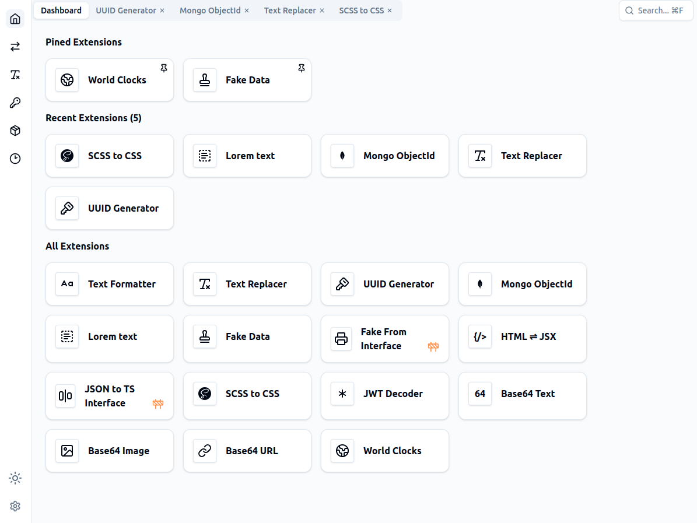
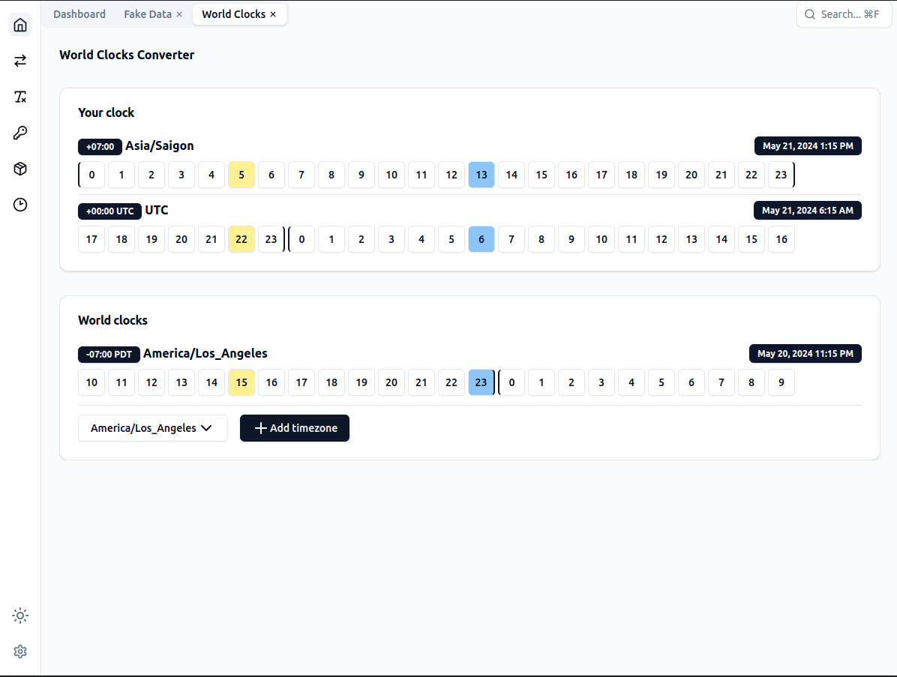
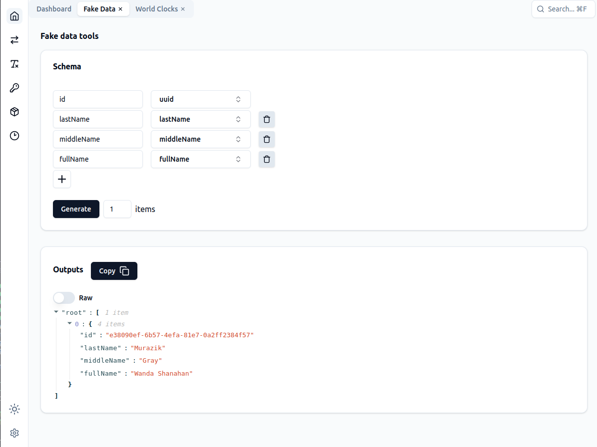
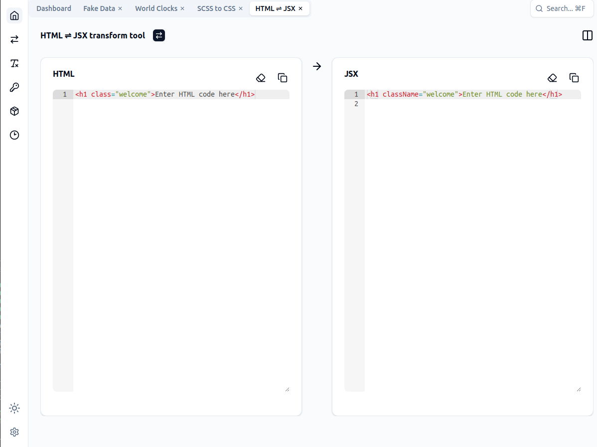
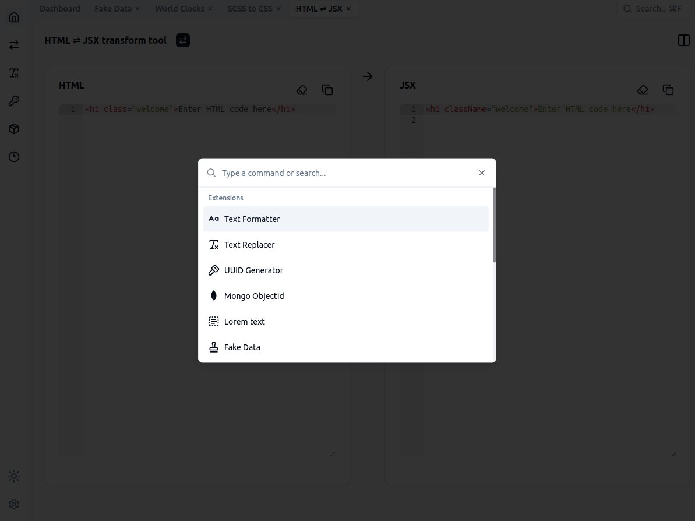
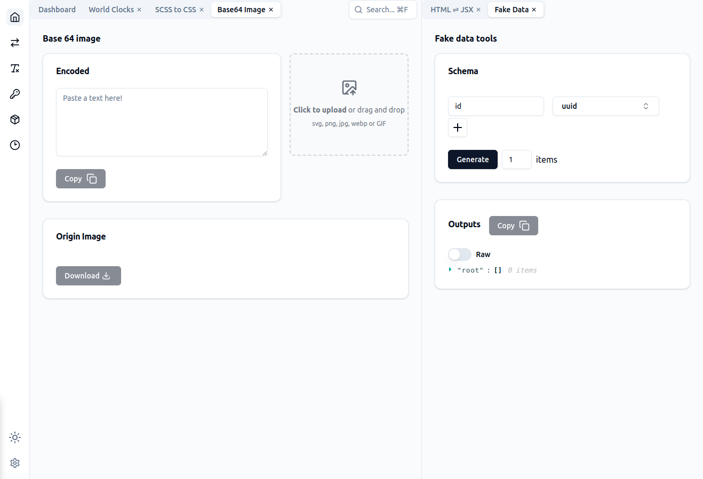

# Dev-SP - Offline Dev Tools

Offline Dev Tools is an Electron application built with React and TypeScript. It provides a set of development tools for developer.

## Downloads

[](https://github.com/phamquyetthang/offline-dev-tools/releases/latest/download/offline-dev-tools.exe)

[](https://github.com/phamquyetthang/offline-dev-tools/releases/latest/download/offline-dev-tools_amd64.deb)

[](https://github.com/phamquyetthang/offline-dev-tools/releases/latest/download/offline-dev-tools.dmg)

[](https://github.com/phamquyetthang/offline-dev-tools/releases/latest)

## Features

#### Generator tools

- UUID Generator
- Mongo ObjectId Generator
- Lorem text Generator
- Fake Data
- Fake From Interface 🚧

#### Transform tools

- HTML ⇌ JSX
- SCSS to CSS
- JSON to TS Interface 🚧

#### Encode/Decode tools

- JWT Decoder
- Base64 Text
- Base64 Image
- Base64 URL

#### Time extensions

- World Clocks

#### Text extensions

- Text Formatter
- Text Replacer

## Screenshots








## Getting Started

### Prerequisites

- Node.js
- npm

### Installation

Clone the repository and install the dependencies:

```bash
$ git clone https://github.com/phamquyetthang/offline-dev-tools
$ cd offline-dev-tools

$ yarn install
```

#### Development

```bash
$ yarn start
```

#### Build

```bash
$ yarn make
```

### Contributing

Contributions are welcome. Please open an issue first to discuss what you would like to change.

### License

[MIT](https://choosealicense.com/licenses/mit/)
